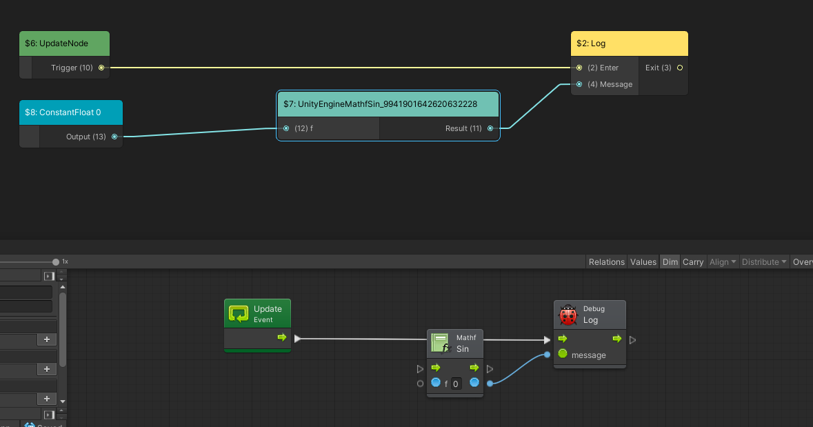
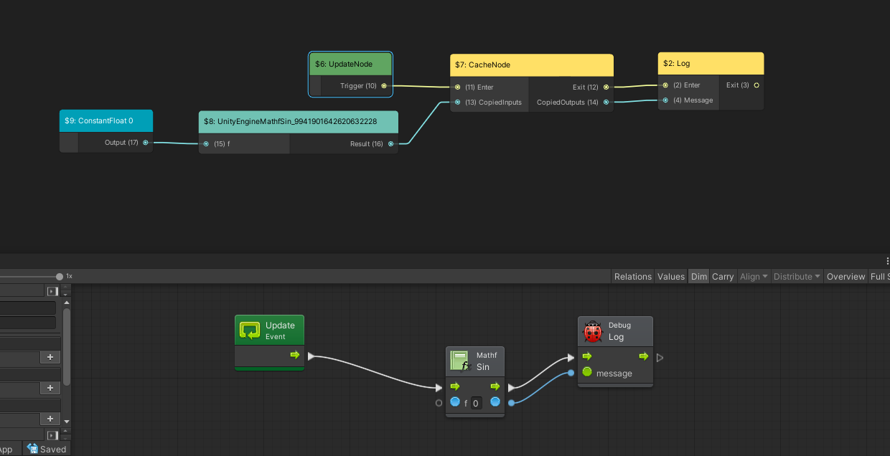
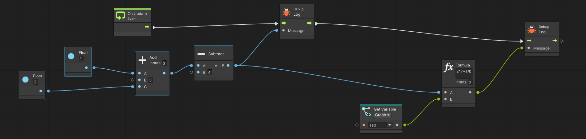
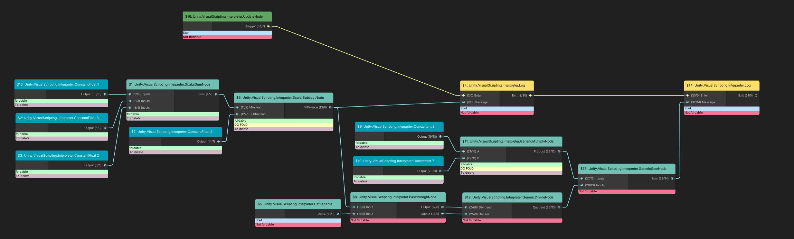
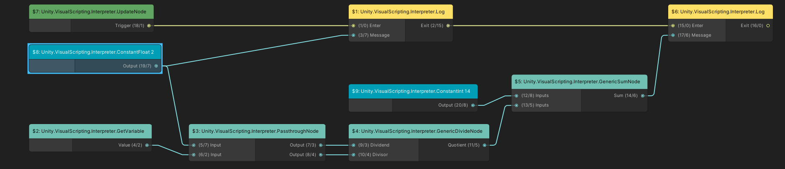

- [New interpreter](#new-interpreter)
  - [Core Types](#core-types)
  - [Value type](#value-type)
    - [To do](#to-do)
  - [Nodes](#nodes)
    - [Ports](#ports)
  - [GraphInstance and execution](#graphinstance-and-execution)
    - [Data](#data)
    - [Execution](#execution)
    - [Coroutines](#coroutines)
  - [GraphDefinition](#graphdefinition)
  - [GraphBuilder](#graphbuilder)
    - [Node mapping](#node-mapping)
    - [Typical use cases](#typical-use-cases)
    - [Postprocessing with Graph Transform](#postprocessing-with-graph-transform)
    - [Node translation](#node-translation)
  - [FlowGraphTranslator](#flowgraphtranslator)
  - [API Node codegen](#api-node-codegen)
    - [Data nodes used as flow nodes](#data-nodes-used-as-flow-nodes)
    - [Integration with the current front end](#integration-with-the-current-front-end)
    - [TODOs and questions](#todos-and-questions)
  - [Constant Folding](#constant-folding)
  - [Future optimizations and refactoring](#future-optimizations-and-refactoring)
    - [Runtime graph topology optimization](#runtime-graph-topology-optimization)
    - [Node level optimization](#node-level-optimization)
    - [Execution engine optimization](#execution-engine-optimization)
    - [DFG](#dfg)
  - [Breaking change](#breaking-change)
  - [TODO list](#todo-list)

# New interpreter

The new interpreter relies on a few core principles:
- the runtime graph is different from the authoring graph. That means separate node implementations for authoring (focus on UX) and execution (focus on performance)
- this separation means we need to translate the authoring graph to a runtime graph. See the translator section
- No boxing when possible, especially for primitive types. That means no casting to `System.Object`. This is mainly achieved by using the `Value` union struct. See the Value section
- The goal is 0 managed allocs, 0 boxing for most operations and an interpreter around 10x faster. The separation of authoring and runtime means we can optimize the runtime graph, similarly to what a compiler does
- No reflection, except if explicitly asked by the user or during playmode in the editor. that means generating nodes for APIs used in a graph

## Core Types

- `GraphDefinition` represents a runtime graph
- All nodes derive from `INode` and friends
- All values are stored in the `Value` struct
- `GraphInstance` is the execution engine. It's instantiated by the `FlowMachine` mono behaviour when using the new runtime
- `RuntimeGraphAsset` is a scriptable object holding the `GraphDefinition`. it's embedded in the FlowGraph at the moment
- The translation happens in `FlowGraphTranslator`. It uses `GraphBuilder` to create the actual runtime graph

## Value type

Union of primitive types (int, bool, ...) and a [.net GCHandle](https://docs.microsoft.com/en-us/dotnet/api/system.runtime.interopservices.gchandle?view=net-5.0) for managed types, plus a `ValueType` field to distinguish them.

`GCHandle` is a struct, meaning no allocation. A reference count is managed by the `GraphInstance` which allows us to determine when an object is garbage collectable.

Enums are stored as an `int` and a type hash. The `System.Enum` type is managed, meaning any cast of an enum to it will trigger an allocation. However, a direct cast of an int to a concrete enum type won't allocate. that's why nodes relying on enums will cast the numeric value at call site.

The `typehash` is registered at initialization ; that means adding an entry to a type hash map. this will allocate, but once at initialization, the first time an enum type is seen. we could probably bake an enum table somewhere and initialize this map once during game startup or scene loading.

### To do

Enums need to support long backed enum types ( `enum X: long { ... }`)

Structs are boxed at the moment; the struct could store a pointer or index in a byte array to remove the boxing, and writing to a value would become a `memcpy`. given the clear entry points for reads/writes, we could reference count those values to know when to release the linked struct.

`GCHandles` are freed when the `GraphInstance` is destroyed meaning that `objects` need to be re-allocated when passed to another graph.

## Nodes

All nodes have some kind of `Execute(GraphInstance ctx)` method. Nodes have access to three things:
- ports declared in the node
- fields (treated as constants at runtime) declared in the node
- everything in the `ctx`: read/write methods take a port in parameter

Types of nodes:
- `IDataNode` only has data ports. Their execution is triggered when pulling on one of the node's outputs
    - `IConstantNode` is a specialization of data nodes. they're executed only once at startup
- `IFlowNode` also has execution ports. Their execution is triggered when an input execution port is triggered
    - `IStateNode` and `ICoroutineStateNode` allow to reference execution state for the node. The state itself is a separate struct implement INodeState.  It has an `Init(Ctx)` method executed once when the graph is instantiated or the coroutine started. The difference between the two kinds of state is that `IStateNode` is instantiated once per graph, when `ICoroutine`
    - `IUpdatableNode` also has an `Update()` method, called after the initial `Execute()` if the node needs further execution. See the enum `Execution` for details on the various modes
- `IEntryPoint` nodes have output execution ports but no input execution port. They are triggered by event hooks somewhere else in the code. They have a `Register` method using the `EventBus` and an optional `AssignArguments` method to copy the event arguments to the node output data ports

### Ports
Nodes can declare ports of all types deriving from `IPort`. They will use them using a combination of these various `ctx` calls:
- `WriteValue(outputdataport, value)`
- `ReadValue(inputdataport)` and its specializations `ReadInt`, `ReadObject<T>`, ...
- `Trigger(outputTriggerPort)`

Example of a data node: multiply

```csharp
public struct ScalarMultiplyNode : IDataNode
{
    public InputDataPort A;
    public InputDataPort B;
    public OutputDataPort Product;

    public void Execute<TCtx>(TCtx ctx) where TCtx : IGraphInstance
    {
        ctx.Write(Product, ctx.ReadFloat(A) * ctx.ReadFloat(B));
    }
}
```

Example of a flow node: If

```csharp
public struct BranchNode : IFlowNode
{
    public InputTriggerPort Enter;
    public InputDataPort Condition;
    public OutputTriggerPort IfTrue;
    public OutputTriggerPort IfFalse;

    public Execution Execute<TCtx>(TCtx ctx, InputTriggerPort port) where TCtx : IGraphInstance
    {
        ctx.Trigger(ctx.ReadBool(Condition) ? IfTrue : IfFalse);
        return Execution.Done;
    }
}
```

Ports are either input or output, data or trigger, single or multi ports.
Multiports represent multiple different ports at runtime. They have a `DataCount` used to iterate on the actual ports. Multiports have a method `SelectPort(uint index)` to get the actual port at a given index.

Example from the `FloatSum` node:
```csharp
public InputDataMultiPort Inputs;
public OutputDataPort Sum;

public void Execute<TCtx>(TCtx ctx) where TCtx : IGraphInstance
{
    var result = ctx.ReadFloat(Inputs.SelectPort(0));
    for (uint i = 1; i < Inputs.DataCount; i++)
        result = result + ctx.ReadFloat(Inputs.SelectPort(i));
    ctx.Write(Sum, result);
}
```

Ports are actually indices ; more on that in the `GraphInstance` and `Translation` sections.

Ports don't have to be assigned if you don't use them, but having conditionally unused ports usually means this node should be replaced by two specialized nodes.

Complete list of port types:
- InputDataPort
- InputDataMultiPort
- OutputDataPort
- OutputDataMultiPort
- InputTriggerPort
- InputTriggerMultiPort
- OutputTriggerPort
- OutputTriggerMultiPort

## GraphInstance and execution

`GraphInstance` references a `GraphDefinition` and a game object and executes the graph in context.

### Data
- It keeps a `Value` array. When reading/writing to ports, that's where the values go.
- This array is indexed by `DataId` structs
- Reading a `DataNode` output executes it recursively (pull model)
- Reading a `FlowNode` output returns the last written value

### Execution
- Triggering an output execution port pushed the node on the execution stack (push model)
- A node returning `Execution.Running` will be added to the `NextFrameNodes` list. At the end of the frame, this list content is moved to the current frame stack.
- Triggering an output execution port pushed the node on the execution stack.
- A node returning `Execution.Yield` will be pushed to the `NodesToExecuteLaterThisFrame` list. At the end of the current execution iteration, this list content is moved to the current frame stack.
- A node returning `Execution.Interrupt` will be pushed to the current frame stack, then the current graph execution is interrupted. After the computation (subgraph execution, ...) is done, the current graph execution is resumed.

For stateful nodes, all states themselves are stored in a `NativeArray<byte>`. A separate array stores offsets in this array for each node. Before executing the node, a pointer is filled with the address of the node state, and a graphInstance method allows to retrieve it by reference:

```csharp
[NodeDescription(typeof(Once))]
public struct OnceNode : IStatefulFlowNode<OnceNode.State>
{
    // the state truc itself
    public struct State : INodeState
    {
        public bool Done;
    }

    public InputTriggerPort Enter;
    public InputTriggerPort Reset;
    public OutputTriggerPort Once;
    public OutputTriggerPort After;

    public Execution Execute<TCtx>(TCtx ctx, InputTriggerPort port) where TCtx : IGraphInstance
    {
        // get the state by reference, allowing to modify it right here without having to reassign it
        ref State state = ref ctx.GetState<OnceNode, State>(in this);
        if (port == Reset)
        {
            state.Done = false;
            return Execution.Done;
        }
        
        if (state.Done)
            ctx.Trigger(After);
        else
        {
            state.Done = true;
            ctx.Trigger(Once);
        }

        return Execution.Done;
    }
}
```

### Coroutines

Bolt's events can be flagged as coroutine. The test to determine *if* the event should trigger is never in a coroutine, but subsequent nodes will be executed in a standard unity coroutine.

Coroutine nodes can have a per-coroutine state: a node like `WaitForSeconds` needs a separate timer *per instance of the node per coroutine* so re-entering the node from another coroutine doesn't reset the timer, unlike a `Once` node's state that will be shared.

ATM the state is instantiated lazily when a node asks for its coroutine state for the first time. The entire graph's coroutine states are duplicated at once. Future optimization: either instantiate the state per node, or pre-compute multiple node state combinations.

The new interpreter has a `bool asCoroutine` parameter in `GraphInstance.Trigger(OutputTriggerPort)` that can be used the same way. It doesn't actually start a Unity coroutine. Instead, when the next node is scheduled, a `uint coroutineId` is associated with it. The id will be propagated to all nodes scheduled later.

At the beginning of a frame, all nodes that were enqueued for the next frame are moved to the current frame's execution list. all active coroutine ids that are not seen in that list are flagged as "to dispose". That's when the coroutine state will be disposed.

## GraphDefinition

The graph definition is a representation of the graph, optimized for runtime. It contains:
- The node list itself
- no edge list per se ; there's a few lists instead
    - the `PortInfo` table contains data about each port. The index of a port in the table is it port index stored in the nested `Port` struct. This data also contains the nature of the port (data or trigger), the related data/trigger index (see below) and the port owner node id
    - The data port table contains the node id of the node connected to this input data port. This is used for recursive data pulling. Indexed by `PortInfo.DataOrTriggerIndex`
    - for triggers, `DataOrTriggerIndex` is the port index of the input trigger connected to the triggered output port.
- A list of variables and their data index. Graph variables are only that: an index in the value array
- A list of initialization values : a value and a data index
- a list of reflected members. Reflected nodes only contain an index in this list

GraphDefinitions have a stable hash, used for live edit. if a user change creates a runtime graph with the same hash (eg. a node has been moved on the canvas, which has no impact on the runtime graph), the live edit is skipped.

## GraphBuilder

Complex builder pattern to output a GraphDefinition, warnings, and a list of API nodes requiring codegen.

The graph builder stores intermediate data and delays the actual creation of the GraphDefinition until its `Build()` method is called.

Before that:
- variables are declared. They come down to a reserved data index
- nodes are added to the builder. A node mapping must be provided at this point. More on this below
- edges are added to the builder. this relies on the node mapping mentioned earlier

Before calling `Build()`, nodes can be removed or replaced, and so can ports. `Build()` will remap node ids and port ids: if the builder contains nodes 1,3,5, the resulting graph will remap them to 1,2,3. Edges are built using those new ids.

### Node mapping

Adding a node to the `GraphBuilder` has a few requirements:
- Its ports must have a unique (at graph-level) port id. Ports with an id of 0 will be ignored at runtime
- If those ports match an authoring port, the link should be registered. It enables highlighting ports/edges and displaying port values during debugging.
    - This link is also what enables creating a runtime edge from an authoring edge. By fetching the runtime port associated to an authoring port, it allows the actual creation of authoring edges
    - Note that runtime ports don't have to have a matching authoring port. This is useful for internal/hidden ports or ports of nodes injected by the translator. See [Data nodes used as flow nodes](#data-nodes-used-as-flow-nodes)

### Typical use cases

1. runtime and authoring nodes map one-to-one:

`PortMapper GraphBuilder.AutoAssignPortIndicesAndMapPorts(IUnit, INode)` will match ports and assign them. It assumes that the runtime port's name (or, if the port has a `PortDescriptionAttribute`, its `PortDescriptionAttribute.AuthoringPortName`) matches the unit port's `key`.

2. runtime and authoring nodes map almost one-to-one:

`INode AutoAssignPortIndicesAndMapPorts(INode inode,  mapping,Dictionary<IUnitPort, FieldInfo> portModelToRuntimeField = null)`

3. Manual mapping

Either for nodes with weird multi-ports or 1-to-many-nodes translations.

Here is the translator of the `SelectOnFlow` node:

```csharp
 var n = new SelectOnFlowNode();

n.Inputs.SetCount(unit.branchCount);
n.Values.SetCount(unit.branchCount);

mapping.AddSinglePort(builder, unit.exit, ref n.Exit);
mapping.AddSinglePort(builder, unit.selection, ref n.Selection);
mapping.AddMultiPortIndexed(builder, unit.GetBranchControlInput, ref n.Inputs);
mapping.AddMultiPortIndexed(builder, unit.GetBranchValueInput, ref n.Values);

builder.AddNodeFromModel(unit, n, mapping);
```

### Postprocessing with Graph Transform

`GraphTransform` allows to implement post-processing passes, running on the graphbuilder *before* it outputs a `GraphDefinition`.

By default, it will call `abstract void DoVisit(NodeId nodeId, INode n, PortMapper nodeMapper)` on each node. The processing logic can be changed completely by overridding `protected virtual void DoRun()`.

Nodes can be added, removed, replaced. `RemapEdges(Dictionary<IPort, IPort> portRemapping)` allows to replace nodes while reusing existing edges.

### Node translation

## FlowGraphTranslator

Creates the `GraphDefinition` using `GraphBuilder` and `PortMapper`. Main phases:
- Declare graph variables
- translate each node. Default translation options only translate entered nodes
    - some node translations are hard coded in the translator, most rely on finding a `NodeTranslator<TUnit>` implementation in the domain
    - the translation must add generated runtime nodes to the builder, which requires a valid `PortMapper`
- translate the edges using the `GraphBuilder`
- output the actual `GraphDefinition` in the `RuntimeGraphAsset`
- output warnings/errors

## API Node codegen

API nodes used to rely on reflection for their execution, which causes multiple performance issues:
- reflection invocation is slow
- arguments and return values are boxed
- it needs AOT prebuild to avoid the invocated member stripping

This interpreter supports reflected nodes (mainly for live edit and data-only DLCs), but offers to codegen those API nodes: one runtime node will be generated for each API node.

See the Integration section for details on the user flow.

### Data nodes used as flow nodes

Bolt allows to use some nodes as flow or data nodes: if no execution ports of a `Mathf.Sin` are connected, the node will be executed every time its output is pulled. If its input execution port is connected, it will be executed as an execution node.

Only "gettable" nodes support that: no `out` parameter and a non-void return value.

To avoid generating two nodes per compatible authoring nodes, the codegen will generate a data node, and if the node is used as a flow node, the translation will add a `Cache` node to it. the cache node will have its execution ports connected to the authoring node enter/exit, its data inputs connected to the data node outputs, and its data outputs connected to the authoring node data outputs ports.

In the next screenshots, the top part is a visualization of the runtime graph, and the bottom part is the authoring graph.

`Mathf.Sin` used as a data node:



The same used as a flow node, with the added cache node:



### Integration with the current front end

UX approval pending.

When a graph is edited, a callback triggers the translation of the graph. The resulting `GraphDefinition` is stored in a subasset of the graph: `RuntimeGraphAsset`. In the future, only this asset will be referenced in the scene, allowing us to exclude the authoring graph from the build.

Warnings emitted during the translation are displayed in the graph and the console.

API nodes with no codegen emit a warning - clicking on the warning will generate them. A new translation after the domain reload will pick them up and replace them in the current graph

### TODOs and questions

- Use generated API nodes in all graphs
- Expose the internal "Generate all missing nodes" menu
- Translate only if the new interpreter is enabled ?
- Expose an option to disable codegen ? For productions trying to deliver a data-only DLC.

## Constant Folding

There is one experimental GraphTransform for now, implementing [Constant Folding](https://en.wikipedia.org/wiki/Constant_folding).

 `1+2` can be replaced by a constant `3`. If a node is considered "pure" (it has no side effects, and its outputs depend only on its inputs) and all its inputs are considered pure, then this node can be considered constant. The user probably need a way to flag nodes as "foldable" (eg. right now, the API code generator cannot know that `Quaternion.identity` is constant, but `Random.value` is not).

 There is a draft of that api in `ConstantFoldingTransform.FoldableData`, see the comments there.

 Here is how the transform itself works:
 - start from definitely-non-foldable nodes 
   - recurse left on all of its inputs
   - determine if that node is foldable, which means:
     - the node itself is pure
     - its inputs all are foldable
     - if that's the case, add it to the `m_NodesToDelete` list
   - if it is foldable, execute the node to get its constant value. as this is done *after* the left recursion, all of its inputs have already been executed
   - if it can **not** be folded, check all of its inputs and add the foldable ones to the `m_NodesToFold` list
 - for each element of `m_NodesToFold`, fold it
   - that means replacing the folded node by its computed constant value
 - delete all nodes in `m_NodesToDelete`

Given this authoring graph:


This is how the folding transform sees it:

Annotation meaning:
- `DO FOLD` means the node is in `m_NodesToFold`
- `To delete` means the node is in `m_NodesToDelete`
- `Start` means the node was part of the initial list of nodes to process

This is the resulting graph after deleting nodes and replacing them with their computed constant value:




## Future optimizations and refactoring

### Runtime graph topology optimization

Using `GraphTranforms`:
- constant stripping: the constant node `3` could be replaced by an initialization value
- pattern matching in the graph: `getComponent().field`, in some cases, can be replaced by `cache(getComponent()); cachedComponent.field`

### Node level optimization

On simple nodes, `Read` and `Write` calls are what takes most of the execution time. Those calls take time for two reasons:
1. Recursion: for data nodes, reading an input often means executing the connected node
2. Indirection: finding the right `Value` array entry

For 1, we could transform the pull model into a push model. For data nodes that read their inputs unconditionally (eg. `1+2`) we could execute all input nodes, then the node itself. That would get rid of the recursion, that would only be necessary for conditional input reading (eg. a `select` node doing `condition ? Read(A) : Read(B)`).

For 2, one solution would be to implement an alternate `GraphInstance` specialized for math. instead of a full `Value` array, it would only contain a `Value[4]` or event `float[4]` array. This would also allow not to allocate one `Value` entry per output data port when those values are clearly temporary.

The general goal is to get closer to a simple sequence of instruction rather than complex recursive virtual method calls.

### Execution engine optimization

Using burst for data-only graph islands might be a major win. isolating those islands in general would be a good candidate for either specialized codegen (meta-nodes containing multiple operations, eg. `A + pow(B,2) * 7 / C`...).

Source generators could be used to generate streamlined versions of some nodes, or even some kind of bytecode runtime

### DFG

DFG is DOTS+Burst, but for graphs (ECS is for tables). In theory, it gives us burst-compiled graphe valuation, potentially with multi-threaded sub-graphs. With the recent refocus of the DFG team on the animation usecase, I don't know how possible this is.

## Breaking change

Bolt boxes all structs and stores the content of variables as boxed objects.

If a variable contains a struct (eg. a vector3), the variable content is a boxed vector3.
A `Get Variable` node will return the *boxed* vector3 and not a copy of the value type.
Calling an instance method on this value might modify the *content* of the variable, instead of a copy. This happens because calling a method by reflection takes the instance as a boxed value ; in that case, the already boxed vector3

Example: 
```
      ┌──────────────┐     ┌────────────────────┐
      │ Get Variable │     │ Vector3.Set method │
      │      vector3◌│─────│◌Instance           │
      └──────────────┘  ┌──│◌X                  │
                 ┌────┐ │  │◌Y                  │
                 │ 42◌│─┘  │◌Z                  │
                 └────┘    └────────────────────┘
```

There's no `Set Variable` node but this will still modify the content of the variable.

This doesn't work anymore with the new runtime:
- structs are still boxed (for now)
- the Set instance method is called from a codegened api node, meaning it's not boxing the value and will modify a copy

## TODO list

P1:
- API codegen: ref parameters
- Reflection: ref/out parameters
- formula node WIP
- UX:
    - UX approval on the API codegen flow (uses clickable warnings in the graph inspector ATM)
    - validate general workflow to toggle new interpreter/get NI errors


P2:
- `Value` boxes `structs`. Probably needs a `void*` to store/`memcpy` them and do reference counting
    - for structs that fit in a Value (size <= sizeof(float4)), store it in the value directly (`fixed buffer byte[16]` in the value)
    - if it doesn't fit: refcounting + void* allocated somewhere to copy structs to/from, keep a structHandle + structSize in the value
- Edge value display for debugging is boxing because the value is stored as an object. Just a simple union `Value/object` would do wonders. For now, the `Values` toggle in the bolt window is completely toggling debugging, not just value display.
- way for the user to tag api nodes as `pure data nodes`/`constant nodes` (`Quaternion.identity` vs `Random.Value`)

Later: either once we get rid of bolt's runtime or if we're willing to optimize both runtimes at once:
- variable declaration objects still have a `Dictionary<string,object>` forcing boxing. Just replacing it with a `Dictionary<string,Value>` and calling `value.Box()` when the bolt runtime uses it would prevent boxing for the new backend
- Custom events box a lot. Mix the variable declaration approach and the variable value wrapping to avoid all that boxing
- Optim:
    - `in Port` ?