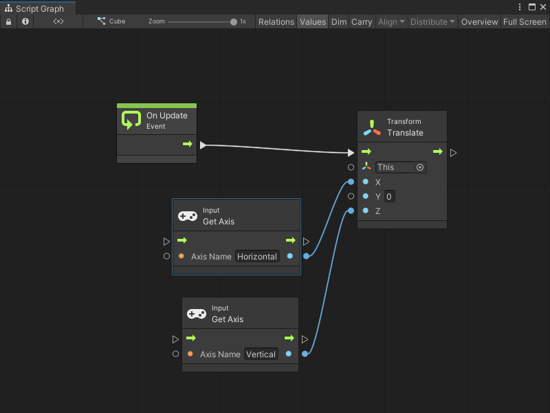

# Capture input with the Input Manager

> [!NOTE]
> You must configure your Project Settings to use the Input Manager with Visual Scripting. For more information, see [Input Manager prerequisites](vs-capture-player-input.md#input-manager-prerequisites).

To create a basic Script Graph that uses the Input Manager to capture input: 

1. [Open](vs-open-graph-edit.md) or [create](vs-create-graph.md) a Script Graph attached to the GameObject that you want your users to move.
1. If there isn't an **On Update** or similar Event node in your graph:
   
   1. [!include[vs-open-fuzzy-finder](./snippets/vs-open-fuzzy-finder.md)]
   1. Go to **Events** > **Lifecycle**, or enter **On Update** in the search field.
   1. Select the **On Update** Event node to add it to the graph.
    
1. [!include[vs-open-fuzzy-finder](./snippets/vs-open-fuzzy-finder.md)]

    > [!TIP]
    > If you right-click and the context menu appears, select **Add Node** to open the fuzzy finder.

1. Go to **Codebase** &gt; **Unity Engine** &gt; **Input**, or enter **Get Axis** in the search field.
1. Select **Get Axis (Axis Name)** to add the Get Axis node to the graph.
1. Repeat Steps 3 through 5 to create a second **Get Axis (Axis Name)** node.
1. On the first Get Axis node, in the **Axis Name** input field, enter `Horizontal`.
1. On the second Get Axis node, in the **Axis Name** input field, enter `Vertical`.

    > [!NOTE]
    > If an Axis Name doesn't match the name in the Input Manager's Project Settings, Visual Scripting displays an error in the Graph Inspector. When you enter Play mode, the Unity Editor also displays an error in the Console window.

1. [!include[vs-open-fuzzy-finder](./snippets/vs-open-fuzzy-finder.md)]
1. Go to **Codebase** &gt; **Unity Engine** &gt; **Transform** or search for **Translate**.
1. Select **Translate (X, Y, Z)** to add a Translate node to the graph.
1. Select the **Result** float output port on the `Horizontal` Get Axis node.
1. [Make a connection](vs-creating-connections.md) to the **X** input port on the **Translate** node.
1. Select the **Result** float output port on the `Vertical` Get Axis node.
1. [Make a connection](vs-creating-connections.md) to the **Z** input port on the **Translate** node. 
    
    The finished graph looks similar to the following image:

    
1. To enter Play mode, select **Play** from the [Unity Editor's Toolbar](https://docs.unity3d.com/Manual/Toolbar.html).
1. While in the [Game view](https://docs.unity3d.com/Manual/GameView.html), press a key mapped as a **Negative Button** or **Positive Button** from the [Input Manager's virtual axes](https://docs.unity3d.com/Documentation/Manual/class-InputManager.html).

The GameObject moves along the X or Z axis in the Game view, based on the key pressed and the [Input Manager Project Settings](https://docs.unity3d.com/Documentation/Manual/class-InputManager.html). 

## Additional resources

- [Capture user input in an application](vs-capture-player-input.md)
- [Capture input with the Input System package](vs-capturing-player-inputs-new.md)
- [On Button Input node](vs-nodes-events-on-button-input.md)
- [On Keyboard Input node](vs-nodes-events-on-keyboard-input.md)
- [On Mouse Down node](vs-nodes-events-on-mouse-down.md)
- [On Mouse Drag node](vs-nodes-events-on-mouse-drag.md)
- [On Mouse Enter node](vs-nodes-events-on-mouse-enter.md)
- [On Mouse Exit node](vs-nodes-events-on-mouse-exit.md)
- [On Mouse Input node](vs-nodes-events-on-mouse-input.md)
- [On Mouse Over node](vs-nodes-events-on-mouse-over.md)
- [On Mouse Up As Button node](vs-nodes-events-on-mouse-up-button.md)
- [On Mouse Up node](vs-nodes-events-on-mouse-up.md)

