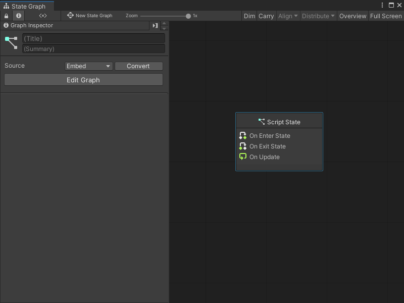
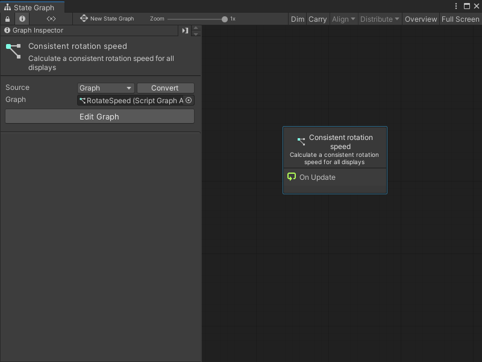
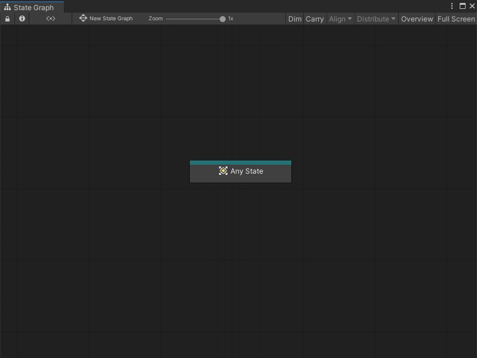
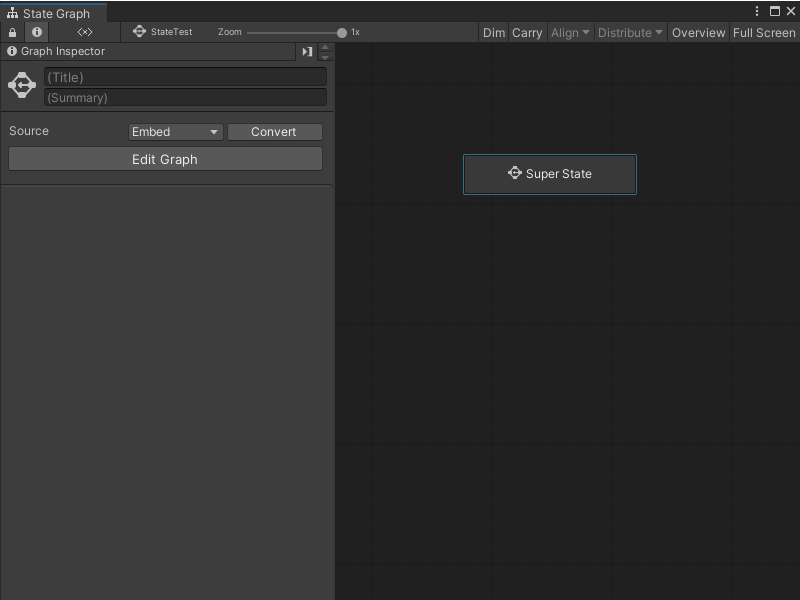
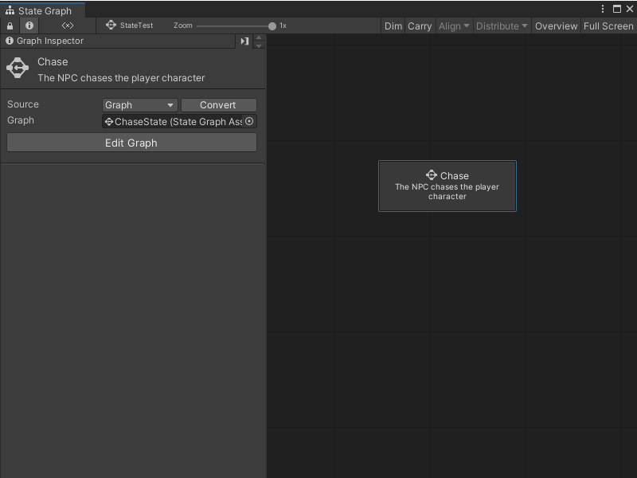

# Create a new state 

You can create three types of State nodes in a State Graph: [Script States](#create-a-script-state), [Any States](#create-an-any-state), and [Super States](#create-a-super-state). For more information on the types of State nodes, see State Graphs in [Graphs](vs-graph-types.md#state-graphs).

You can also add a [Sticky Note](vs-sticky-notes.md) to add comments to a graph.

## Create a Script State

To create a new blank Script State: 

1. [!include[vs-open-state-menu](./snippets/vs-open-state-menu.md)]
2. Select **Create Script State**. 

    Visual Scripting creates a new Script State node.
3. Open the [**Graph Inspector**](vs-interface-overview.md#the-graph-inspector).
4. In the **Graph Inspector**, choose a source for the Script State node:
    
    - **Embed**: The graph only exists on the Script State node. You can only modify the graph from the node in its parent State Graph.
    - **Graph**: The graph exists in a separate file. You can modify the graph outside of its parent State Graph and reuse the graph in other areas of your application.
1. If you chose **Graph**:

    1. Select **New**.
    1. Enter a name for the graph file.
    1. Choose where you want to save the new graph.
    1. Select **Save**.
    

To create a Script State from an existing Script Graph: 

1. [!include[vs-open-state-menu](./snippets/vs-open-state-menu.md)]
2. Select **Create Script State**.
    Visual Scripting creates a new Script State node.
1. Open the [**Graph Inspector**](vs-interface-overview.md#the-graph-inspector).
1. In the **Graph Inspector**, set the source for the Script State node to **Graph**.
1. Do one of the following:

    * Select the object picker (circle icon) and choose a compatible Script Graph from your project.
    * Click and drag a Script Graph file from your **Project** window and release on the **Graph** field.

> [!TIP]
> Click and drag the Script Graph from your Project window into the Graph Editor to automatically create a Script State node. 

## Create an Any State 

To create a new Any State node: 

1. [!include[vs-open-state-menu](./snippets/vs-open-state-menu.md)] 

2. Select **Create Any State**. 

## Create a Super State 

To create a new blank Super State: 

1. [!include[vs-open-state-menu](./snippets/vs-open-state-menu.md)]
2. Select **Create Super State**. 

    Visual Scripting creates a new Super State node.
1. Open the [**Graph Inspector**](vs-interface-overview.md#the-graph-inspector).
1. In the Graph Inspector, choose a source for the Super State node:
    
    * **Embed**: The graph only exists on the Super State node. You can only modify the graph from the node in its parent State Graph.
    * **Graph**: The graph exists in a separate file. You can modify the graph outside of its parent State Graph and reuse the graph in other areas of your application.
1. If you chose **Graph**:

    1. Select **New**.
    1. Enter a name for the graph file.
    1. Choose where you want to save the new graph.
    1. Select **Save**.

To create a Super State from an existing State Graph: 

1. [!include[vs-open-state-menu](./snippets/vs-open-state-menu.md)]
1. Select **Create Super State**. 

    Visual Scripting creates a new Super State node.
1. Open the [**Graph Inspector**](vs-interface-overview.md#the-graph-inspector)
1. In the Graph Inspector, set the source for the Super State node to **Graph**.
1. Do one of the following:

    * Select the object picker (circle icon) and choose a compatible State Graph from your project.
    * Click and drag a State Graph file from your Project window and release on the **Graph** field.

> [!TIP]
> Click and drag the State Graph from your Project window into the Graph Editor to automatically create a Super State node. 
