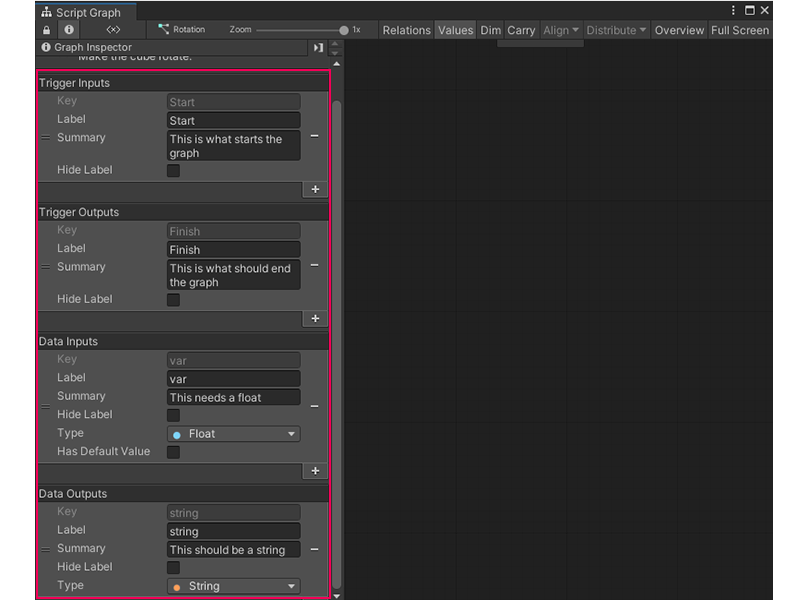

# Add a Trigger or Data port to a Script Graph

A Script Graph used as a Subgraph can receive data and logic from its parent graph. Add and define ports on a graph to choose what data graphs can send and receive. 

For more information about Subgraphs, see [Subgraphs and State Units](vs-nesting-subgraphs-state-units.md).

## Add ports from a graph

To add a Trigger Input, Trigger Output, Data Input, or Data Output port to a Script Graph:

1. [Open the Script Graph](vs-open-graph-edit.md) you want to edit in the Graph window.
2. With no nodes or groups selected in the graph, open the [Graph Inspector](vs-interface-overview.md#the-graph-inspector).
3. Select **Add** (+) under the port type you want to add:

   - **Trigger Inputs**
   - **Trigger Outputs**
   - **Data Inputs**
   - **Data Outputs**
4. In the **Key** field, enter a unique key name for the port. The Key value can't match the Key of any existing ports on the current Script Graph.

    > [!NOTE] 
    > If two **Key** values are the same on the same graph, Visual Scripting ignores the second port definition and displays a warning in the Graph Inspector. If you change the **Key** value for a port after you've made a connection to that port in a graph, the connections break and you must reconnect them.
5. In the **Label** field, enter a label to display for the port. The label displays on the Subgraph node and its Input or Output node.

    > [!NOTE] 
    > If you don't set a **Label**, Visual Scripting uses the value from the **Key** field.
6. In the **Summary** field, enter a brief summary of the port to display in the Graph Inspector when you select the Subgraph node, Input node, or Output node.
7. Toggle **Hide Label** to do the following:
   - Enable **Hide Label** to hide the port label on any Subgraph node, Input node, or Output node.
   - Disable **Hide Label** to display the data from the **Label** field.
8. (Data Inputs and Data Outputs Only) Set a data type for the port:
   1. Select the **Type** list to open the Type menu.
   1. Select a data type from the list to set the data type the port accepts.
9. (Data Inputs Only) Enable **Has Default Value** to display the **Default Value** field. Disable **Has Default Value** to hide the **Default Value** field.

    In the **Default Value** field, enter the default value the port uses if it doesn't receive a data input while the Script Graph runs.

## Add ports with Input and Output nodes

You can also use an [Input node](vs-nesting-input-node.md) or an [Output node](vs-nesting-output-node.md) to define ports on a Script Graph:

1. [Open the Script Graph](vs-open-graph-edit.md) you want to edit in the Graph window.
1. [!include[vs-open-fuzzy-finder](./snippets/vs-open-fuzzy-finder.md)]
1. Go to **Nesting**.
1. Do one of the following:

    * To add a Trigger Input or Data Input port to the graph, select **Input**.
    * To add a Trigger Output or Data Output port to the graph, select **Output**.

1. Select the new Input or Output node in the graph.
1. Open the [Graph Inspector](vs-interface-overview.md#the-graph-inspector).
1. In the **Key** field, enter a unique key name for the port. The Key value can't match the Key of any existing ports on the current Script Graph.

    > [!NOTE]
    > If two **Key** values are the same on the same graph, Visual Scripting ignores the second port definition and displays a warning in the Graph Inspector. If you change the **Key** value for a port after you've made a connection to that port in a graph, the connections break and you must reconnect them.
1. In the **Label** field, enter a label to display for the port. The label displays on the Subgraph node and its Input or Output node.
    
    > [!NOTE]
    > If you don't set a **Label**, Visual Scripting uses the value from the **Key** field.
1. In the **Summary** field, enter a brief summary of the port to display in the Graph Inspector when you select the Subgraph node, Input node, or Output node.
1. Toggle **Hide Label** to do the following:

    * Enable **Hide Label** to hide the port label on any Subgraph node, Input node, or Output node.
    * Disable **Hide Label** to display the data from the **Label** field.
1. (Data Inputs and Data Outputs Only) Set a data type for the port:

    * Select the **Type** list to open the Type menu.
    * Select a data type from the list to set the data type the port accepts.
1. (Data Inputs Only) Enable **Has Default Value** to display the **Default Value** field. Disable **Has Default Value** to hide the **Default Value** field.

    In the **Default Value** field, enter the default value the port uses if it doesn't receive a data input while the Script Graph runs.

## Next steps

Add the Script Graph as a Subgraph in another Script Graph. For more information on how to add a Script Graph as a Subgraph, see [Add a Subgraph to a Script Graph](vs-nesting-add-subgraph.md). 

For more information on the port types on a Script Graph, see [Subgraph node](vs-nesting-subgraph-node.md). 

The defined Trigger and Data ports affect the ports on the Input and Output nodes in a Script Graph. For more information, see [Input node](vs-nesting-input-node.md) and [Output node](vs-nesting-output-node.md).