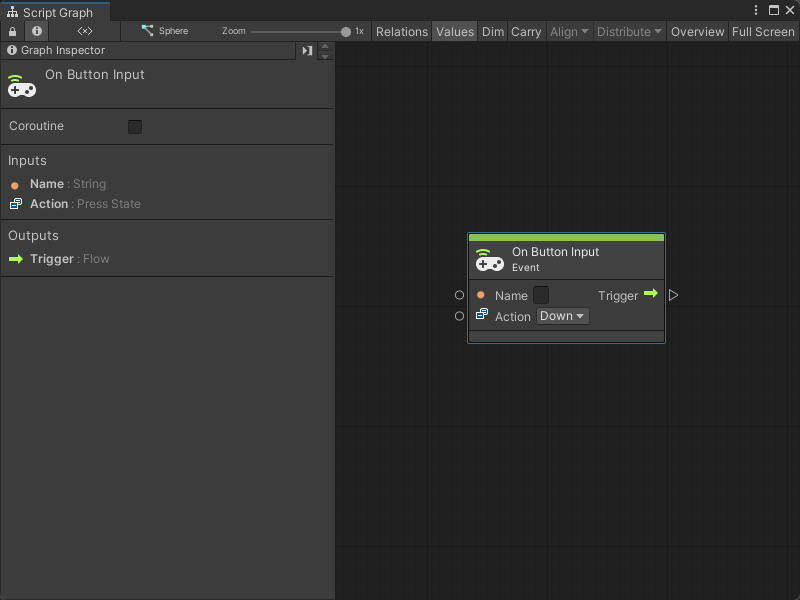
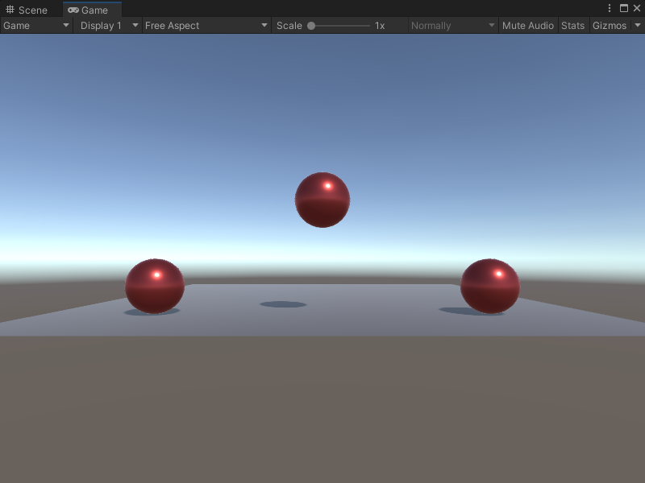

# On Button Input node

> [!NOTE]
> The On Button Input [!include[nodes-note-manual](./snippets/input-manager/nodes-note-manual.md)]

The On Button Input node listens for a specified action on a virtual button from your Input Manager configuration. [!include[nodes-desc-end](./snippets/input-manager/nodes-desc-end.md)]

## Fuzzy finder category 

The On Button Input node is in the **Events** &gt; **Input** category in the fuzzy finder. 

## Inputs 

The On Button Input [!include[nodes-inputs](./snippets/nodes-inputs.md)] 

| Name | Type | Description |
|---|---|---|
| **Name** | String | The name of the button the node listens to for an Input event, as it appears in the Input Manager. |
| **Action** | Press State | The specific press state of the button that the node listens for. The options are: <ul><li>**Hold:** The user holds down the button.</li><li> **Down:** The user presses the button.</li><li> **Up:** The User releases the button. </li></ul>|

## Additional node settings 

The On Button Input [!include[nodes-additional-settings](./snippets/nodes-additional-settings.md)]

[!include[nodes-coroutine](./snippets/nodes-coroutine.md)

## Outputs

The On Button Input [!include[nodes-single-output](./snippets/nodes-single-output.md)]

[!include[nodes-input-output-trigger](./snippets/input-manager/nodes-input-output-trigger.md)]

## Example graph usage 

In the following example, the On Button Input node listens for the user to press the button or key assigned to the **Jump** axes in the Input Manager. When the user presses the button, the On Button Input node triggers the Rigidbody Add Force node, which adds an **Impulse** Force to the Rigidbody's **Y** axis:

The Add Force node makes the **Target** Rigidbody lift into the air. 

## Related nodes 

[!include[nodes-related](./snippets/nodes-related.md)] to the On Button Input node:

- [On Keyboard Input node](vs-nodes-events-on-keyboard-input.md)
- [On Mouse Down node](vs-nodes-events-on-mouse-down.md)
- [On Mouse Drag node](vs-nodes-events-on-mouse-drag.md)
- [On Mouse Enter node](vs-nodes-events-on-mouse-enter.md)
- [On Mouse Exit node](vs-nodes-events-on-mouse-exit.md)
- [On Mouse Input node](vs-nodes-events-on-mouse-input.md)
- [On Mouse Over node](vs-nodes-events-on-mouse-over.md)
- [On Mouse Up node](vs-nodes-events-on-mouse-up.md)
- [On Mouse Up As Button node](vs-nodes-events-on-mouse-up-button.md)