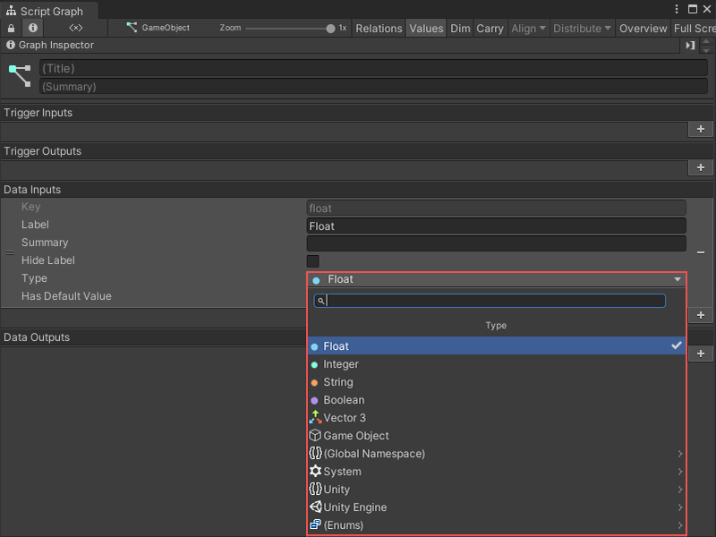

# Object types 

All scripting in Unity is based on the C# programming language. C# is a "strongly typed" language. This means that all data and objects in Visual Scripting have a specific type. For example, a variable can be a number with an `integer` type, or the object provided by a node's output port can be a `GameObject`. 

Types help the computer run Visual Scripting code. Visual Scripting's behavior might not depend on the object type you give a node as an input, but sometimes, an object's type is important. 

For example, to add a new variable in the Blackboard, you must specify the variable's type to assign it a value. When you make a new edge in the Graph Editor, some nodes might have ports that only allow a connection if the data input is the correct type. 

Choose the type for an object with the Type menu. For example, you can choose the type for a Data Input port on a Script Graph with the Type menu from the [Graph Inspector](vs-interface-overview.md#the-graph-inspector).

Enter a search term in the Type menu to find a specific object type. You can also navigate through the namespaces listed in the Type menu to find a type. 

Visual Scripting identifies namespaces in the Type menu with an arrow (>). Select any namespace to view the other namespaces or available types within that namespace. 

## Common object types

Unity has hundreds of types. You can also add your own custom types. For more information on custom types, see [Custom types](vs-custom-types.md).

The following table includes some commonly used types in Visual Scripting. 

| Type | Description |
| :--- | :--- |
| **Float** | A float is a numeric value, with or without decimal places.  For example, `0.25` or `13.1`. |
| **Integer** | An integer is a numeric value without decimal places.  For example, `3` or `200`. |
| **Boolean** | A Boolean is a `true` or `false` value. Use a Boolean to create logic in a Script Graph and for toggles.  For example, a Script Graph can trigger an event only if a condition is `true`. |
| **String** | A string is a sequence of characters or piece of text.  For example, `string`, `string123`, and `s`. |
| **Char** | A char is a single alphanumeric character from a string.  For example, `s` or `1`. |
| **Enum** | An enum is a finite enumeration of options. Enums are usually represented as dropdowns.  For example, a <strong>Force Mode</strong> enum can have a value of either `Force`, `Impulse`, `Acceleration`, or `Velocity Change`. |
| **Vector** | A vector represents a set of float coordinates. Unity uses vectors for positions or directions. **Vector 2:** A Vector 2 has X and Y values. You can use a Vector 2 for coordinates in 2D spaces.  **Vector 3:** A Vector 3 has X, Y, and Z values. You can use a Vector 3 for coordinates in 3D spaces.  **Vector 4:** A Vector 4 has X, Y, Z, and W values. You can use a Vector 4 for coordinates in 4D spaces, such as parameters for shaders. |
| **GameObject** | A GameObject is the basic entity used in Unity scenes. All GameObjects have a name, a transform for their position and rotation in the scene, and a list of components. |
| **List** | A list is an ordered collection of elements. The elements in a list can each have their own type or all have the same type.  Visual Scripting indexes items in a list with the first position at 0. This means that the first element of a list is at the `0` index of the list. The second item is at the `1` index, the third is at the `2` index, and so on. |
| **Dictionary** | A dictionary is a collection of elements. Each element has a unique key and a value. Use a key to access and assign the values for an element in a dictionary.  For example, you can use a dictionary to organize the names and ages of a group of people. The person's name is the key to the value of their age. A single element in the dictionary can be `John` and `33`. |
| **Object** | An Object is a special type in Unity. If a data input port on a node has its type set to `Object`, the node doesn't need a specific type as an input. |

## Supported type conversions 

Visual Scripting can automatically convert some data types passed between nodes. For example, the following graph gets the Transform from a child GameObject of the current GameObject, and triggers an Animator Controller to play an animation. Visual Scripting converts the Transform component sent by the Transform Get Child node to the Animator Controller component on the same GameObject. 

Visual Scripting can automatically perform the following type conversions: 

- Number to Number (for example, you can convert an integer to a float, such as 5 to 5.0, or 5.0 to 5)

- Base class to child class 

- Child class to base class 

- Custom operators (for example, you can convert a Vector 2 to a Vector 3)

- GameObject to a component (for example, a GameObject to its Rigidbody component)

- Component to GameObject (for example, a Rigidbody component to its GameObject)

- Component to component on the same GameObject (for example, a Rigidbody component to a Transform component)

- Enum to array 

- Enum to list 